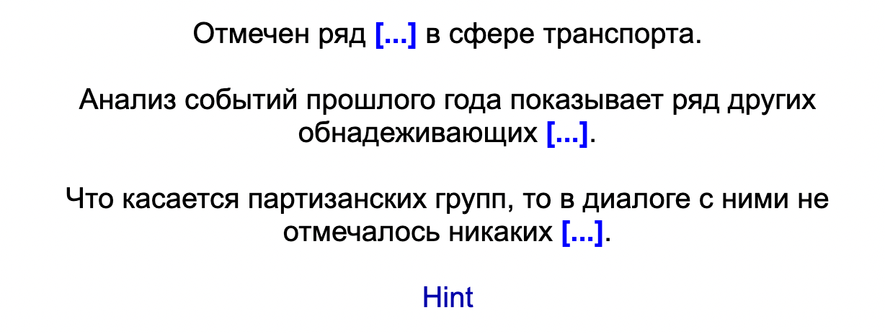
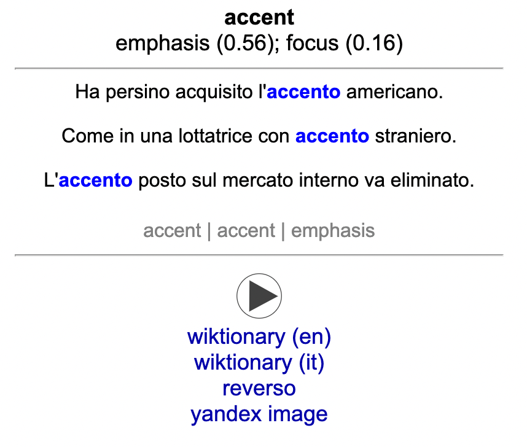
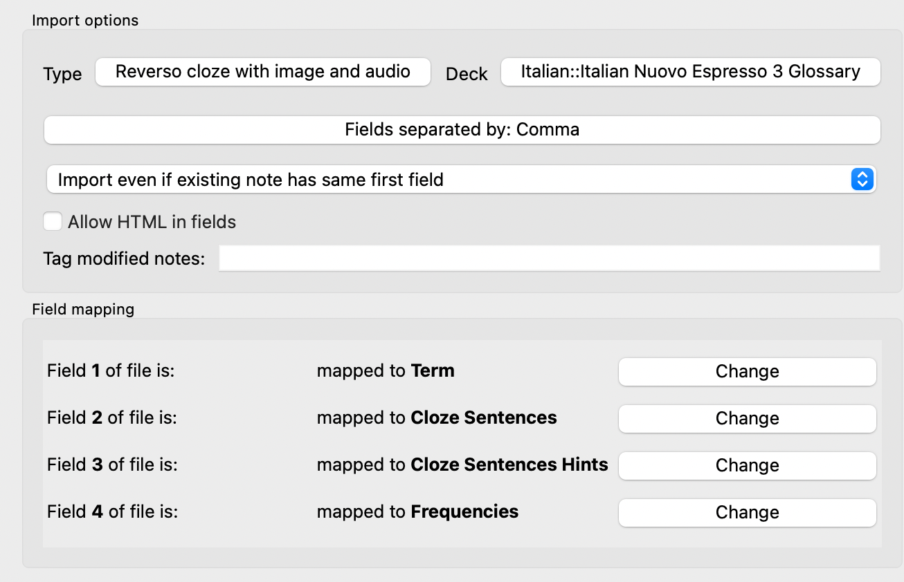

# Anki Reverso Cloze Card Creator
This is a script for automatically creating Anki cloze cards using sentence
examples from Reverso for language
learning. It leverages the [unofficial Python Reverso
API](https://github.com/demian-wolf/ReversoAPI).

Given a list of strings, it will create a CSV file that can be used to create Anki
notes with three columns:

1. Term
2. Example sentences from Reverso, with cloze
3. Reverso's translation of the definition in the example sentences
4. Top N frequencies of definitions (e.g., a word can have different meanings)

This README assumes basic background knowledge of Anki cards and does not
explain any of the related terminology.

## Examples

The script creates a CSV that can be imported into Anki. If you're interested in
exactly what's generated, you can look in the spoiler below. Otherwise, continue
reading.

<details>
Here is an example of a line from the raw CSV created by the script, pulling
three example sentences for the Italian phrase `a memoria` with the target term
contained in a cloze. It also has relative ratios for the frequency of
translations. For example, this term is most commonly translated to "by heart",
but it can also be translated to "from memory" (with a relative 0.27 frequency
to "by heart").

```
a memoria,"Studialo bene ed imparalo {{c1::a memoria}}.

È fuori questione imparare tutte queste frasi {{c1::a memoria}}.

Cantatelo {{c1::a memoria}}, o leggendolo.",by heart | by heart | from memory,<b>by heart</b></br>from memory (0.27); in memory (0.12)
```
</details>

After creating a note type and importing the CSV, you'll get cards that have the
following respective front and back sides:

### Front


### Back


## Usage
Using this assumes some basic knowledge of coding.

Install the prerequisites: 
```
pip3 install progress
```

### Steps
1. Create a file called `queries.txt` with one term per line.
2. Run `python3 reverso_note_maker.py -s it` where `it` (Italian) can be
   replaced by the two letter language code. Wait for it to finish.
3. Import the created file `reverso.csv` into the Anki desktop app, with the
   columns matching in the order shown below. You will have to create a new note
   type.



To see the full list of options:
```
python3 reverso_note_maker.py --help
```

### Potential issues
* **Sleeping**: If your computer goes to sleep, you'll need to restart the
    script, but it'll pick up from where you left off.
* **Rate-limiting**: Reverso may block or throttle you. The script waits one
    second between requests and has a retry mechanism, but if it happens, run
    the script again.

