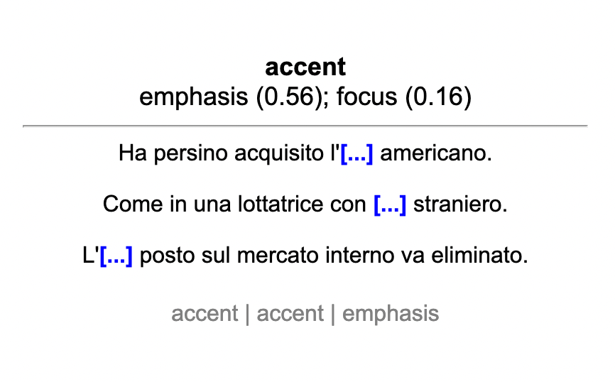

# Anki Reverso Cloze Card Creator
This is a script for automatically creating Anki cloze cards using sentence
examples from Reverso for language
learning. It leverages the [unofficial Python Reverso
API](https://github.com/demian-wolf/ReversoAPI).

Given a list of strings, it will create a CSV file that can be used to create Anki
notes with three columns:

1. Term
2. Example sentences from Reverso, with cloze
3. Hint (the translation of Term)

This README assumes basic background knowledge of Anki cards and does not
explain any of the related terminology.

## Examples

Here is an example of a line from the raw CSV created by the script, pulling
three example sentences for the Russian word `толще` with the target term
contained in a cloze:

```
толще,"Нужно нарезать груши {{c1::толще}} чем яблоки, потому что они готовятся быстрее.

Благодаря действию активных компонентов ресницы становятся длиннее, {{c1::толще}} и выглядят объемнее.

Можешь взять кого-нибудь и сделать немножко {{c1::толще}} и ниже
ростом.",thicker | thicker | fatter
```

After creating a note type and importing the CSV, you'll get cards that have the
following respective front and back sides:

### Front


### Back


## Usage
Using this assumes some basic knowledge of coding.

Install the prerequisites: 
```
pip3 install progress
```
### Steps
1. Create a file called `queries.txt` with one term per line.
2. Run `python reverso-note-maker.py -s it` where `ru` (Italian) can be replaced
   by the two letter code. Wait for it to finish.
3. Import the created file `reverso.csv` into the Anki desktop app, with the
   columns matching in the order shown below. You will have to create a new note
   type.

Note: due to rate limiting, the script sleeps for 1 second between each word to
prevent flooding the Reverso API.


